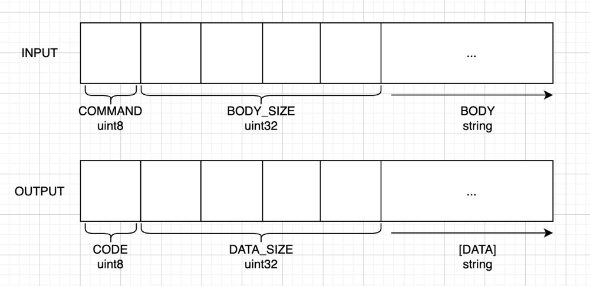

# TINYQ

An fast, light, straightforward, high performance, stateless message queue, supporting both queue and topic modes, implemented using Rust and Tokio.

# Develop

## The current development status of the TinyQ

## Protocol

### Input: COMMAND BODY_SIZE BODY

- COMMAND: Type is uint8(fixed 1-byte), refer to [Command Definition](./src/command/mod.rs)
- BODY_SIZE: Type is uint32(fixed 4-byte), Byte length of the body, [0, MAX_BODY_SIZE]
- BODY: Content of the command parameters

### Output: CODE [DATA]

- CODE: Type is uint8(fixed 1-byte), refer to [ECode Definition](./src/ecode.rs)
- DATA_SIZE: Type is uint32(fixed 4-byte)
- DATA: Returned based on the command and status code (has a value for data_size > 0)
