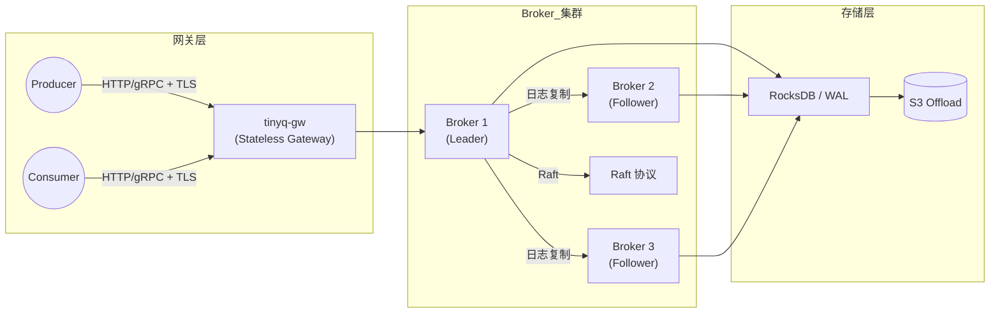
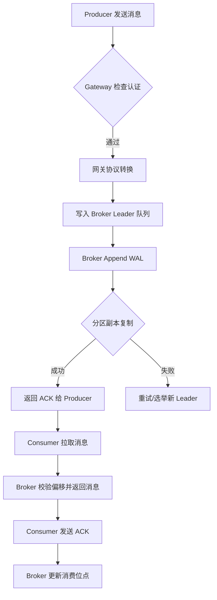
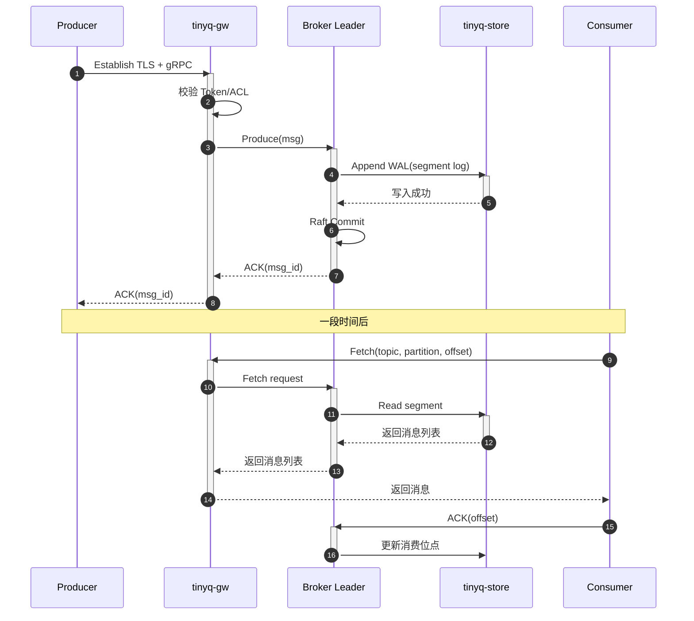

## **1 重新定位与目标**

| **维度**           | **过去**                   | **重构后目标**                              |
| ------------------ | -------------------------- | ------------------------------------------- |
| **可靠性**         | 基于内存、进程崩溃即丢消息 | 至少 *At‑Least‑Once*，可升级 *Exactly‑Once* |
| **可扩展性**       | 单节点 / 手工 sharding     | 水平扩展、自动分区 + 副本                   |
| **可观测性**       | 基础日志                   | 指标、链路追踪、分布式 tracing              |
| **安全性**         | 明文 TCP                   | TLS、Token/ACL                              |
| **易用性**         | 自定义协议                 | 继续支持，但附带 gRPC + REST 网关           |
| **Dev Experience** | 单体 crate                 | 多 crate + workspaces + CI/Pipelines        |


## **2 总体架构**

```
          ┌────────────┐          ┌───────────────┐
          │  tinyq-gw  │──HTTP/gRPC──▶ tinyq‑broker ◀─┐
Producer ─▶            │          │   (Leader)    │   │
Consumer ◀┤  stateless │◀─────────┤               │   │
          └────────────┘          └────────────┬──┘   │  Raft
                   ▲                   ▲       │      │
                   │ TLS / auth        │ WAL   │      ▼
                   │                   │   ┌────────────┐
          Prometheus/OpenTelemetry     └──▶│ tinyq‑store│
                        ▲                  │  (RocksDB  │
                        │                  └────────────┘
                Grafana / Jaeger
```


### **2.1 组件说明**

| **组件**                 | **责任**                                      | **关键技术**                    |
| ------------------------ | --------------------------------------------- | ------------------------------- |
| **tinyq‑protocol**       | 二进制 & Protobuf IDL；版本协商               | bytes、prost                    |
| **tinyq‑core**           | 队列、主题、分区、消费组、流控、ACK           | async/await、tokio, parking_lot |
| **tinyq‑store**          | 可插拔存储——默认 RocksDB/WAL，支持 S3 offload | rocksdb, tokio‑fs, crc32        |
| **tinyq‑broker**         | Broker 实例；Raft 选主；复制；数据切片        | openraft, tonic                 |
| **tinyq‑gw**             | 网关/反向代理；限流；鉴权；多协议             | axum, tower                     |
| **tinyq‑ctl / tinyq‑ui** | CLI + Web UI；运维、监控、动态扩容            | clap, leptos                    |
| **tinyq‑clients**        | Rust/Go/Python SDK；高层 API & 自动重试       | reqwest, tokio‑stream           |


## **3 协议与数据模型**

1. **保持兼容**：沿用COMMAND | BODY_SIZE | BODY框架；首字节保留旧 Command；新增 *Version=0xFE* 触发协商。
2. **消息键**：msg_id = <partition,offset>；外加 128‑bit 去重 Token。
3. **ACK**：分阶段
   - v1：客户端批量 NACK/ACK；重试间隔指数退避
   - v2：幂等生产者 + 去重表 (Bloom filter + 周期快照)
4. **传输层压缩**：可协商 *snappy / zstd*。
5. **序列化**：Body 允许 Raw | JSON | Protobuf 标记，网关可做转换。


## **4 关键设计决策**


### **4.1 持久化日志 (Segment Log)**

- **写路径**：内存 RingBuffer → WAL append → 异步 flush (fsync=O_DSYNC)
- **段文件**：按大小/时间滚动；末段刷新后加入读索引。
- **压缩策略**：Cold 段后台 zstd；Hot 段保留原样。
- **索引**：稀疏索引 + Bloom；确保 O(1) 顺序读。


### **4.2 分区与复制**

- 每主题 *N* 分区；每分区 *R* 副本 (Leader+Followers)。
- Raft 日志复制；复制超时自动选主；支持 Observer 只读副本。
- **Rebalance**：基于一致性哈希环；增减节点零停机。


### **4.3 消费模式**

| **模式**          | **说明**                      | **实现细节**                      |
| ----------------- | ----------------------------- | --------------------------------- |
| **ConsumeMode**   | 消费组内部竞争；偏移存 broker | 采用 *Range/Modulo* 分配 + Sticky |
| **BroadcastMode** | 发到所有组/实例               | 对每组独立维护偏移，高效 fan‑out  |


### **4.4 内存 & 并发**

- **Zero‑Copy**： bytes::Bytes + mmap 读取冷段。
- **Backpressure**：tokio mpsc::channel + Dynamic capacity；对外暴露 *credit‑based* flow control。
- **并行调度**：多 partition / topic 为独立 task；利用 Tokio task::spawn_local + work‑stealing。


### **4.5 观测性**

- **tracing** 宏收集 span；导出 OTLP。
- Prometheus 指标：写放大、滞后、重试率、p99 延迟。
- 审计日志：生产/消费、失败原因、ACL 命中。


### **4.6 安全**

- TLS ( rustls ) + mTLS 可选。
- JWT / HMAC token；ACL 基于topic, group, action。
- “权限漂移”热更新：网关实时拉取 Policy。


## **5 代码结构 & 工程实践**

```
tinyq/
├─ crates/
│  ├─ core/          # queue abstraction, state machine
│  ├─ protocol/      # binary + protobuf definitions
│  ├─ store/         # pluggable storage engine
│  ├─ broker/        # cluster node
│  ├─ gw/            # stateless gateway
│  └─ clients/       # common client logic
├─ apps/
│  ├─ tinyq-broker/
│  ├─ tinyq-gw/
│  └─ tinyq-ctl/
└─ Cargo.toml (workspace)
```

- **Feature Flags**：rocksdb, s3, tls, metrics —— 编译按需裁剪。
- **CI**：cargo check --all-features; cargo tarpaulin; miri Undefined Behaviour 检查。
- **Bench**： criterion + flamegraph；自动生成性能报告。
- **Release**：GitHub Actions → cross‑compile → Docker multi‑arch (amd64/arm64)。


## **6 渐进式迁移路线**

| **0** | *Refactor‑Core*  | 提炼 crates、替换 tokio::codec→tokio‑util::codec |
| ----- | ---------------- | ------------------------------------------------ |
| **1** | *Durable‑Single* | 引入 WAL + 重启恢复；兼容旧协议                  |
| **2** | *Cluster‑Beta*   | Raft + 分区；运维 CLI；Prom metrics              |
| **3** | *Security & GW*  | TLS/mTLS、鉴权、网关热更新                       |
| **4** | *Observability*  | OpenTelemetry、Grafana dashboards                |
| **5** | *SDK & UI*       | Rust/Go/Python 客户端；Web 控制台                |
| **6** | *Exactly‑Once*   | 幂等生产 + 去重表、事务 API                      |
| **7** | *Ecosystem*      | k8s Operator、Helm、Terraform 模块               |


## **7 面向未来的演进**

1. **流处理 API**：Flink API 兼容层；窗口 & 事件时间。
2. **Serverless Connector**：WebAssembly filter，按需执行 ETL。
3. **存算分离**：冷热分层；Iceberg/LakeHouse 直写。
4. **无缝 Geo‑Replication**：基于 CRDT 的跨区域最终一致。


# 8 相关图标

## 架构图


## 流程图



## 时序图



